# Rebalance Relax

[Visit the website here](https://elenaderothschild.github.io/Rebalance-Relax/)

Created as an online platform for individuals to learn about, explore and engage with the massage therapy services offered by an individual practitioner. The website serves a virtual gateway, providing information, building trust, and facilitating the booking process to enhance the overall experience for clients seeking massage services.

This website is made up of the following sections:

1. Home/Introduction
2. Treatment options and prices
3. Get in touch contact form

The business goals for this website are:

1. To introduce an individual entrepreneur to wide public 
2. To inspire users to try offered services
3. Earn income from services rendered
4. Acquire and increase the number of clients by offering an easy and efficient way of communication
   Improve online visibility through SEO strategies to attract potential clients searching for massage services
5. Enhance brand recognition by maintaining a cohesive visual identity across the website and marketing materials
6. About me section: share the story, values and mission of the massage therapy business to connect with clients on a personal level
7. Implement loyalty programs to incentivise repeat business and foster a sense of loyalty among clients 
8. Therapist credentials: highlight qualifications, certifications, and expertise of massage therapist to instil confidence in potential clients
9. Social media integration: integrate social media links to leverage additional channels for marketing and community engagement

The user goals of this website are:

1. To have seamless experience by accessing the website on different size screens
2. To have enhanced satisfaction by being able to intuitively navigate through the website to find all information needed
3. To be able effectively communicate and book appointments via the contact form and direct contact details
4. To learn about different types of massage therapy and their benefits to wellbeing

## Design

### **Colour Scheme**

I chose soothing and calming colour scheme to complement images and create a tranquil and relaxing atmosphere. Neutral off white #FAF9F6 and transparent rgba(255,255,255,0.4) helps to create a clean and pure environments and beige/gray rgba (208,195,195,0.4) complements other colours and adds a sense of sophistication. I chose black colour rgb(29,28,28) for the text to provide enough contrast for readability for the users.

## **Typography**

Google fonts was used to import chosen fonts for the website. I have used DM Serif Display as I felt it looked modern, traditional yet classy. 

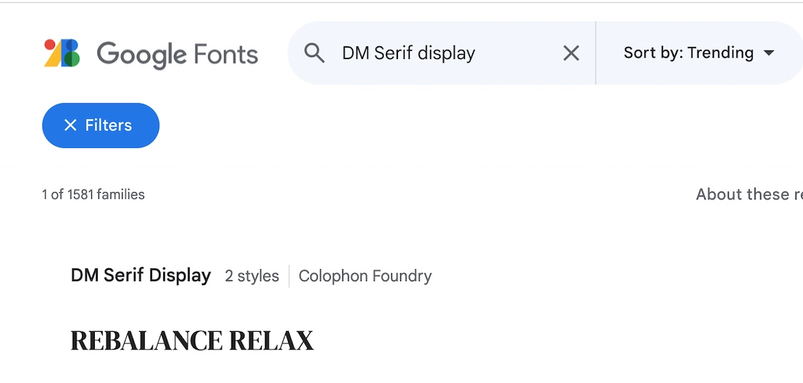

I used DM Sans for the body of the website as I felt it had neutral and approachable appearance with clean and contemporary design. It offers readability across different platforms and sizes.

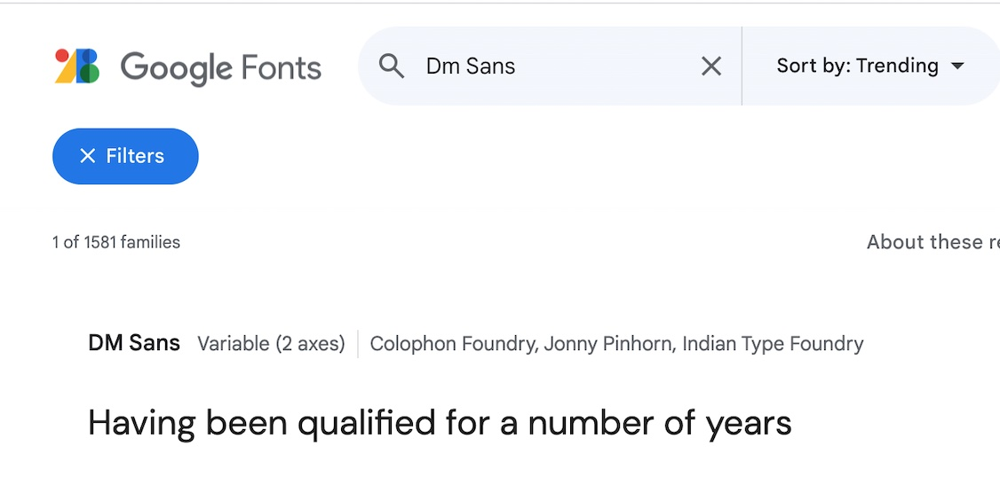

## UX
---
### **Strategy**

Target users are:

1. Aged 25-65
2. Individuals looking for maintenance of overall wellbeing and incorporating massage therapy as part of a healthy lifestyle.
3. People looking for massage as means of relaxation and stress relief
4. Individuals looking for massage therapy to deal with particular physical ailments, pain and muscular discomfort
5. People with regular or high intensity physical activity looking for a massage as a tool for muscle recovery and injury prevention
6. Expectant mothers looking for prenatal massage

### **Scope**

1. Easy to find information, easy website navigation
2. Inspirational photographs 
3. Guidance on different types of massage therapy and cost
4. Convenient way of communicating and getting in touch 

The website offers all these things and is easy to use and navigate through.
Given the age group of users the website is likely to be viewed on different screen sizes hence importance of the website responsiveness.

### **Structure** 
 
This is a three-page website to allow desired information to fit. It has navigation bar at the top which allows users to access different parts of the website.
I tried to mix pieces of information with images to aid better visual experience.
The drop-down treatment menu is used to prevent information overload at first glance and also save space on mobile screens. It allows immediate basic information uptake with an option of going into more detail if required. Different layout is used for larger screens to make use of available space.

### **Skeleton**

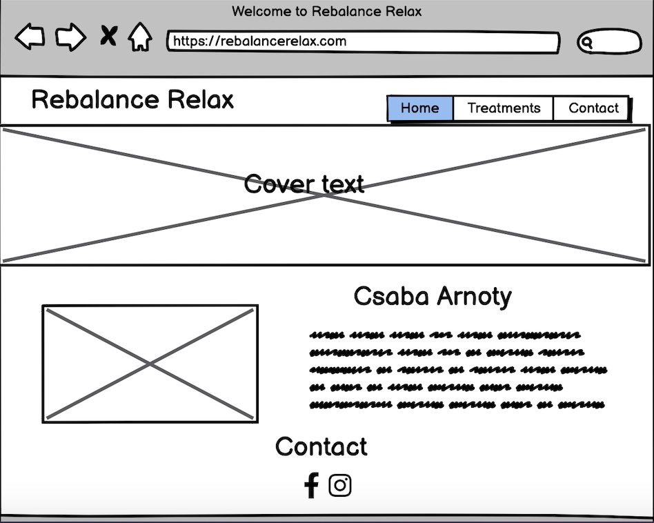
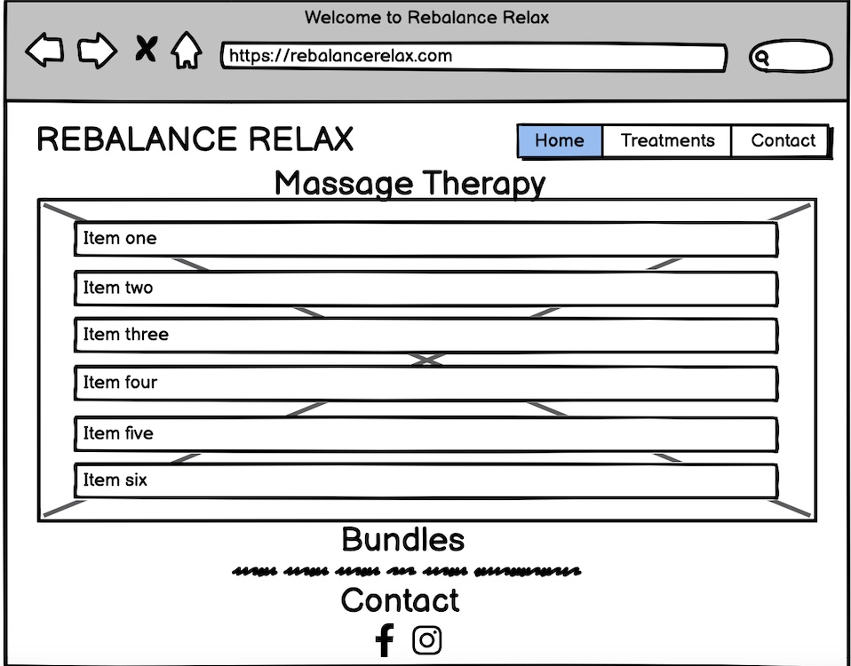
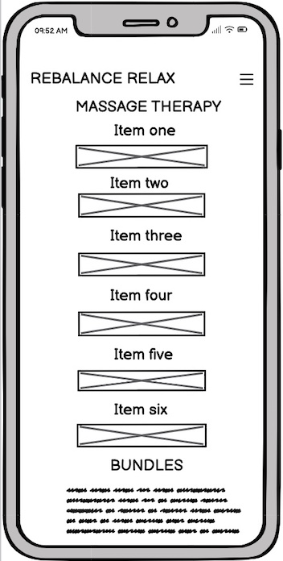
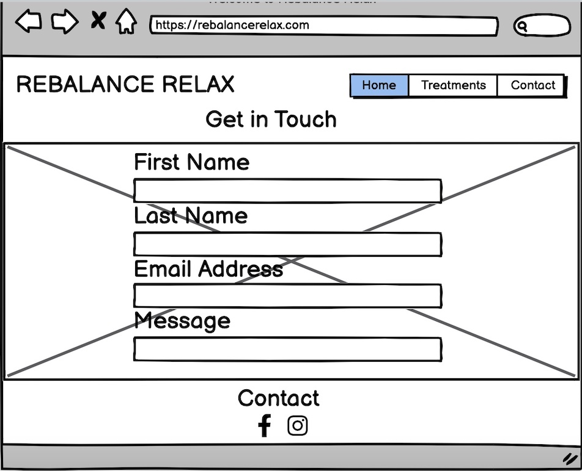

The website differs slightly from created wireframes. Once created the treatments and home page looked bare so I decided to add more images and content, and change the layout for better visual experience. The feedback from friends and family also influenced the changes.

### **Surface**

I chose colour palette based around beige/brown tones as I find those colours being calm, warm and comforting that suit business idea of relaxation and stress relief. I chose black color text to allow appropriate contrast. I used Google fonts DM Sans and DM Serif Display.
I felt DM Serif Display provides for a touch of luxury and DM Sans complements DM Serif Display and allows for easy read.

---

## **Features**

 This is a fully responsive website that was designed mobile-first as many people would use mobiles to view
 it. First page is divided into two sections and the other two pages just have one section. The background colour with opacity has been used to provide contrast to cover-text and images. I used DM Serif Display for all of the headings and DM Sans Serif for the body text. This allows for cohesive design throughout the website.

### *Navbar*

The navbar is positioned on the top of the page, the menu collapses into a hamburger icon for space saving on mobile screens. The navigation bar is fully responsive with links to Home, Treatments and Contact pages. This allows the user to easily navigate from page to page.

### *Home*

This is an introduction of the service provider where he shares his path to being a massage therapist. It also mentions therapist's qualifications. I used H2 and H3 elements followed by three paragraphs and an image of the therapist. This page also has a testimonials section.

### *Treatments*

This page has a treatment menu which has information about types of treatment and prices. I used Details element for a mobile screen layout. It allows to see information at a glance and then read more about the treatments when clicking the arrow. I used a table to organise pricing information for treatment bundles.
I have changed the layout for larger screens to make use of the space and provide better visual user experience.

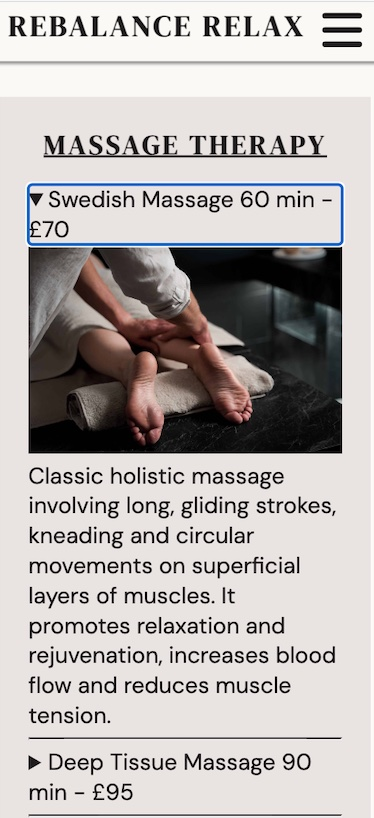

### *Contact*

This is a contact form which allows a user to send an enquiry. The form uses 2 text inpits, an email input, textarea element and a send button.

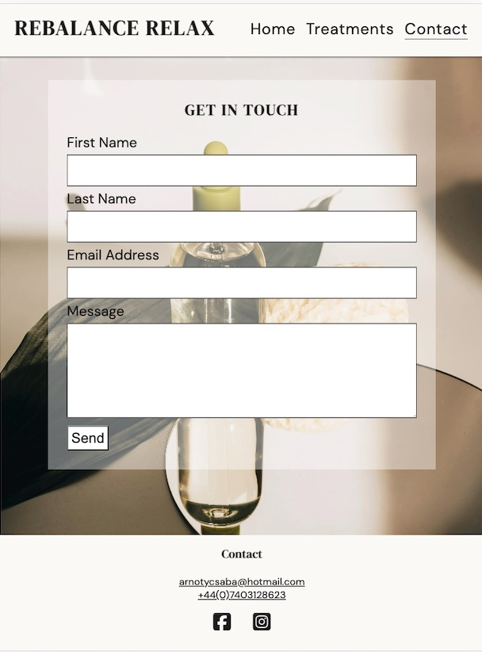

### *Features left to implement*

I would like to add online booking, payment feature and cancellation policy.

---

## Technologies Used 

I have used several technologies that have enabled this design to work:

- [HTML](https://developer.mozilla.org/en-US/docs/Web/HTML)
    - Building block to structure the content
- [CSS](https://developer.mozilla.org/en-US/docs/Learn/Getting_started_with_the_web/CSS_basics)
    - Style the web content
- [Google Fonts](https://fonts.google.com/)
    - To import fonts used in the proejct
- [Font Awesome](https://fontawesome.com/)
    - To import the social media icons for the footer
- [Google Developer Tools](https://developers.google.com/web/tools/chrome-devtools)
    - To inspect,fix issues and bugs and test responsiveness
- [GitHub](https://github.com/)
    - To store code for the proejct
- [Git](https://git-scm.com/)
    - Used to commit to Git and push to Github
- [Codeanywhere](https://app.codeanywhere.com/)
    - Used as a developmemt environment
- [Balsamiq](https://balsamiq.com/)
    - Used to create wireframes for the project
- [Favicon.io](https://favicon.io/)
    - Used to create favicon's for my website
- [Tiny.png](https://tinypng.com/)
    - To compress the images for faster loading
- [W3C Markup Validation Service](https://validator.w3.org/) 
    - Used to validate all HTML code
- [W3C CSS Validation Service](https://jigsaw.w3.org/css-validator/#validate_by_input)
    - Used to validate all CSS code
- [AmIResponsive](http://ami.responsivedesign.is/)
    - Used to generate responsive image for the README file
- [Pexels.com](https://pexels.com)
    - Used to source out images for the project
---
## Testing

### **User goals**

As a user, I want clear navigation on the website pages and to easily find information about the types of massages available.

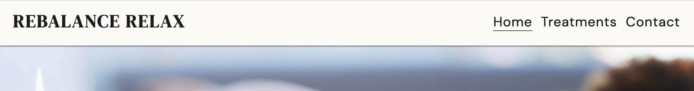

As a potential client, I would want to see a professional and inviting design on the website.
As someone seeking massage therapy for a specific concern, I would like to see detailed information about different massage techniques.

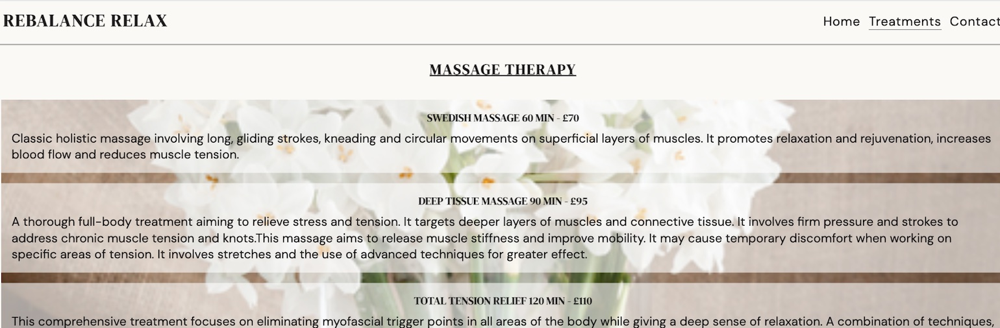

As a first-time user I am interested in seeing testimonials from previous clients to give guidance on the level of satisfaction from offered services.

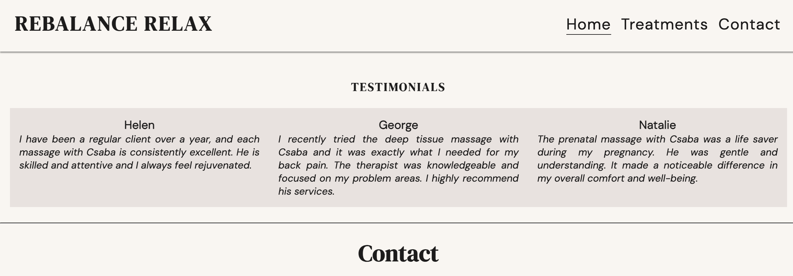

As a person interested in the cost of services, I want to see aclear pricing information and any available package deals.

As a user seeking convenience, I would like to have an easy option to make and enquiry and contact the therapist.

### Manual Testing

Home Page

| Feature | Expected Outcome | Testing Performed | Result | Pass/Fail |
| --- | --- | --- | --- | --- |
| Navbar | Links directing the user to other pages | Clicked each link| Directed to relevant pages| Pass |

Treatments Page

 Feature | Expected Outcome | Testing Performed | Result | Pass/Fail |
| --- | --- | --- | --- | --- |
| Clickable arrows on mobile screens| When the arrow clicked information about each treatment displayed | Clicked each arrow| Information displayed| Pass |

Contact Page

 Feature | Expected Outcome | Testing Performed | Result | Pass/Fail |
| --- | --- | --- | --- | --- |
| Contact Form | The form is not submitted unless all inputs were filled out | Tried to submit the form without required information| The message please fill in this field was displayed| Pass |
| Contact Form | The form is submitted if all the inputs were filled in| Filled in all inputs| The form was submitted| Pass |

Footer

 Feature | Expected Outcome | Testing Performed | Result | Pass/Fail |
| --- | --- | --- | --- | --- |
| Social media links | Tried to click on social media icons| Social medial links opened in the new window| Pass |

### **Lighthouse**

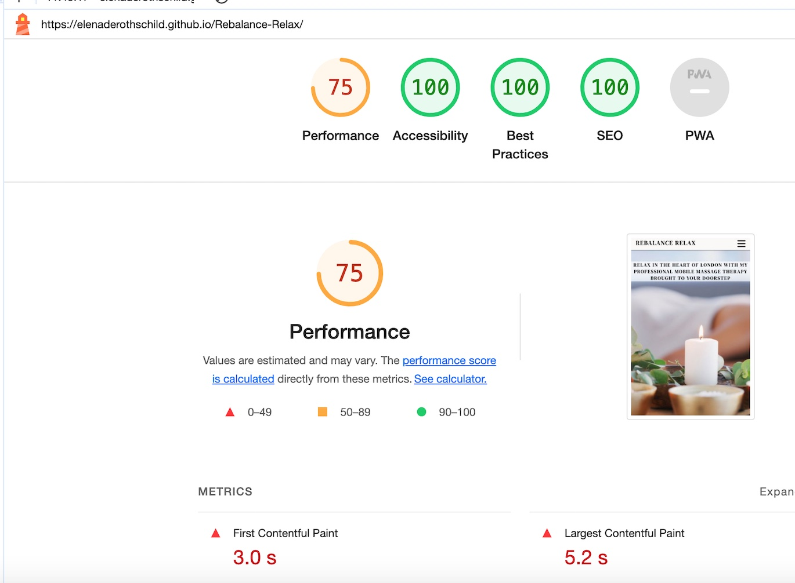

### **HTML and CSS Validation**

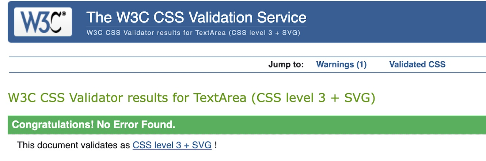

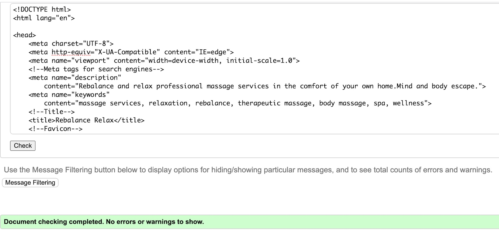

### **Known bugs and fixes**

The bugs encountered were typos and syntax errors which were discovered using CSS and HTML validators.

---
## Deployment

I deployed this website by using GitPages and following the below steps:

*GitHub pages deployment* 

1. Log in to GitHub
2. In your Repository section, select the project repository that you want to deploy
3. In the menu located at the top of this section, click 'Settings'
4. Select 'Pages' on the left-hand menu - this is around halfway down
5. In the source section, select branch 'Master' and save
6. The page is then given a site URL which you will see above the source section, it will look like the following: 

*Cloning the GitHub Repository*

Cloning your repository will allow you to download a local version of the repository to be worked on. Cloning can also be a great way to backup your work.

1. Find the relevant GitHub repository
2. Press the arrow on the Code button
3. Copy the link that is shown in the drop-down
4. Now open Gitpod & select the directory location where you would like the clone created
5. In the terminal type 'git clone' & then paste the link you copied in GitHub
6. Press enter and your local clone will be created.

---
## Credits

The following websites/articles were used for research and guidance:

- [Media Queries](https://css-tricks.com/snippets/css/media-queries-for-standard-devices/)

- [W3Schools](https://www.w3schools.com)

The below websites were used for the content: 

- The content and therapist's photo came from the massage therapist
- A number of the images were found on [Pexels](https://pexels.com), [Istock](https://istockphoto.com)

---
## Acknowledgements

I would like to thank my course mentor Jubril Akolade for his support and guidance throughout the course of the project and Codeanywhere tutors Sarah, Gemma and John.

---

